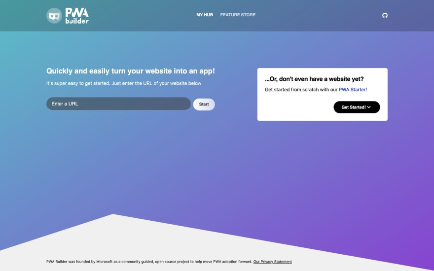
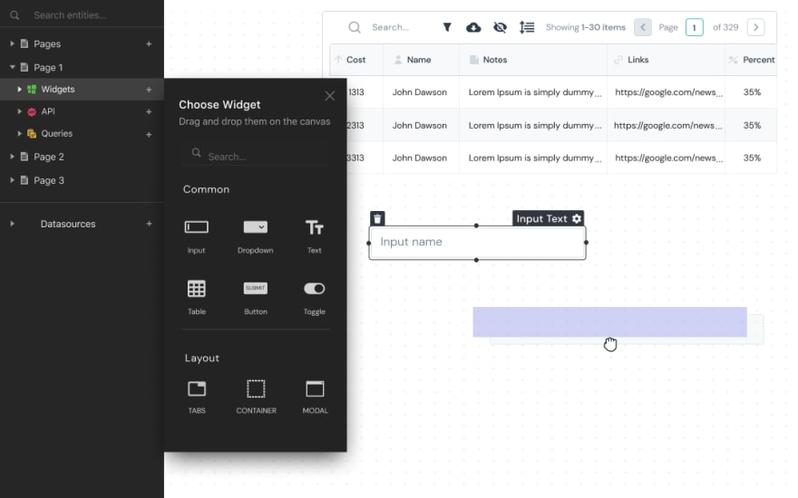
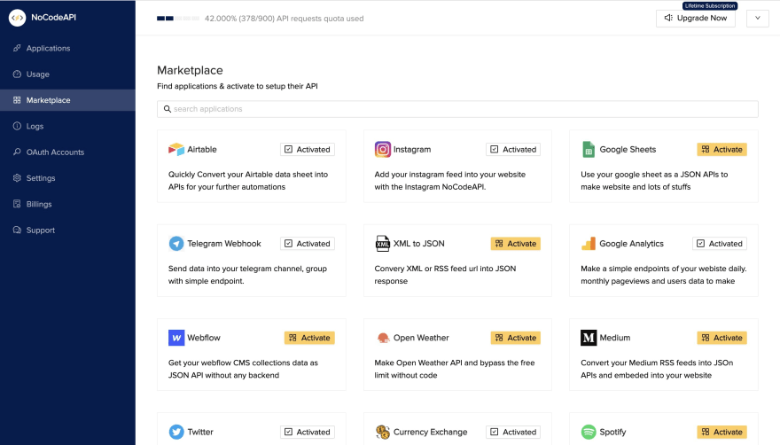
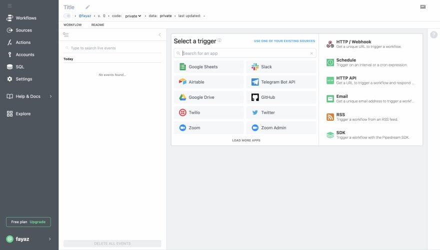
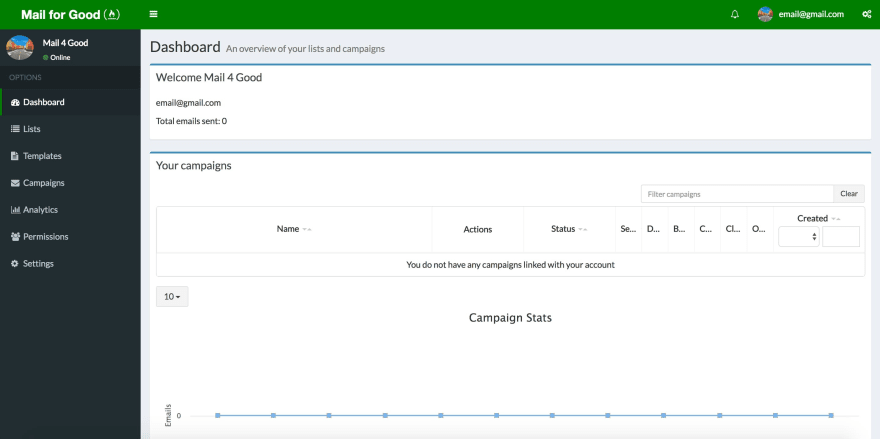
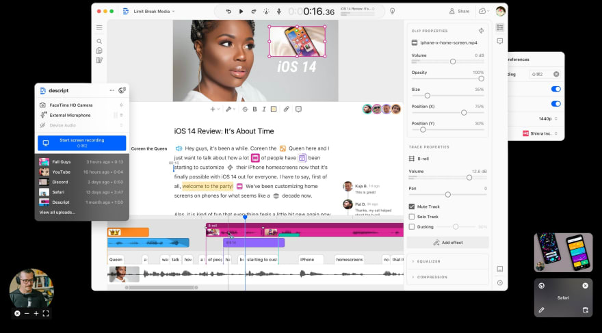
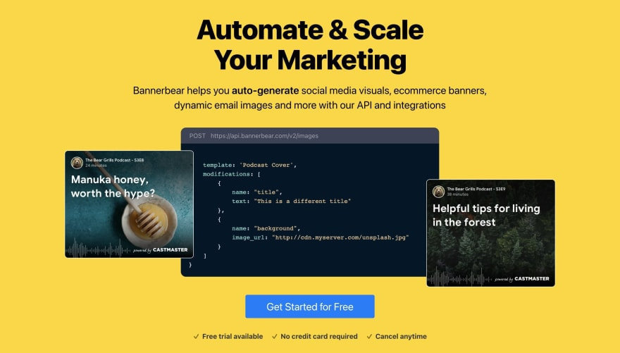
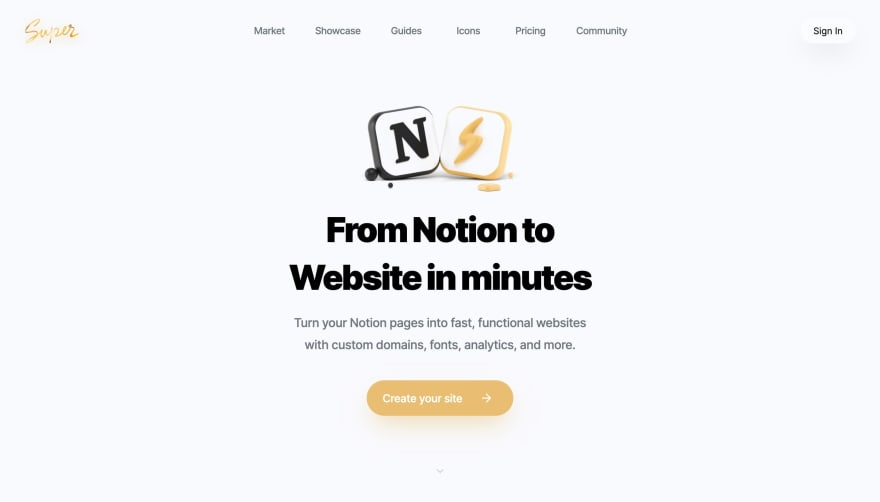

# No-code Tools
A collection of useful No-code tools for developers.

 

## 📝 List of Tools

- [PWABuilder](https://www.pwabuilder.com/)

- [AppSmith](https://www.appsmith.com/)

- [NoCodeApi](https://nocodeapi.com/)

- [PipeDream](https://pipedream.com/)

- [Letter](https://letter.so/)

- [Mail 4 Good](https://github.com/freeCodeCamp/mail-for-good/)

- [Descript](https://www.descript.com/)

- [BannerBear](https://www.bannerbear.com/)

- [Super](https://super.so/)